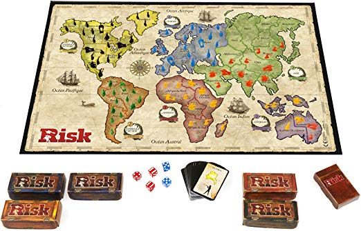

# Build your own game!

# Risk-Game-Project
Risk is a strategy board game of diplomacy, conflict and conquest, it was invented in 1957 by Albert Lamorisse, a French filmmaker, and went on to become one of the most popular board games in history  This is a simple version developed for appling python programing concepts on a fully playable terminal based game.
# Project Description
In this project, we created our first software! Our task was create a game that interacts with the user, using the functions and basic python resources we learned during the first week, building our own code from scratch.
# Game Description
Risk was invented in 1957 by Albert Lamorisse, a French filmmaker, and went on to become one of the most popular board games in history.

“ Risk is a strategy board game of diplomacy, conflict and conquest for two to six players “  (Wikipedia)

* Each Turn players attempt to capture territories with results determined by dice rolls. 
* Occupy every territory on the board
* There are multiple verison and variations to speed the game
* It can take form 15min ( card version ) to  several hours ( or days)

# Challenges

* A board game without a board (terminal only)
* Complex rules game
* Visually depended game to build player strategy
* Multiplayer capability

# Process

* Map main process 
* Simplify game
* Figure it out the code solution
* Code is based on two classes, a board and display tools

  * Class use

  Attacks are methods of object of country class object, since army is inside of the country.
  Object Player only linked to the object country and the distribution of armies
  
  * Variables

  List of country serves to distribute them only ( like the cards on the game).
  List of players to form the playing sequence.
  
# Running the game

Execute file   and follow the instructions. This is a Lord of the Rings theme Risk.

# Game Dynamic

* Setting the Game round

At First, countries are distributed for all players them playing order is set so each player start to place first round armies.

* Rounds

Map will be display in at the begining of eqch player turn at each round

At the begining of each round , all player receive an amont of armies based on the amonut of countries they have. In the playing order them place their armies and the turn go back to the first player, so he can decid what to do.

  * Attacking
When attacking it will attack until is no longer possible

  * Moving Armies
  
  * No action and passing turn

As this game go on until the end!

* Game finish

Game will finish when there is only on player

